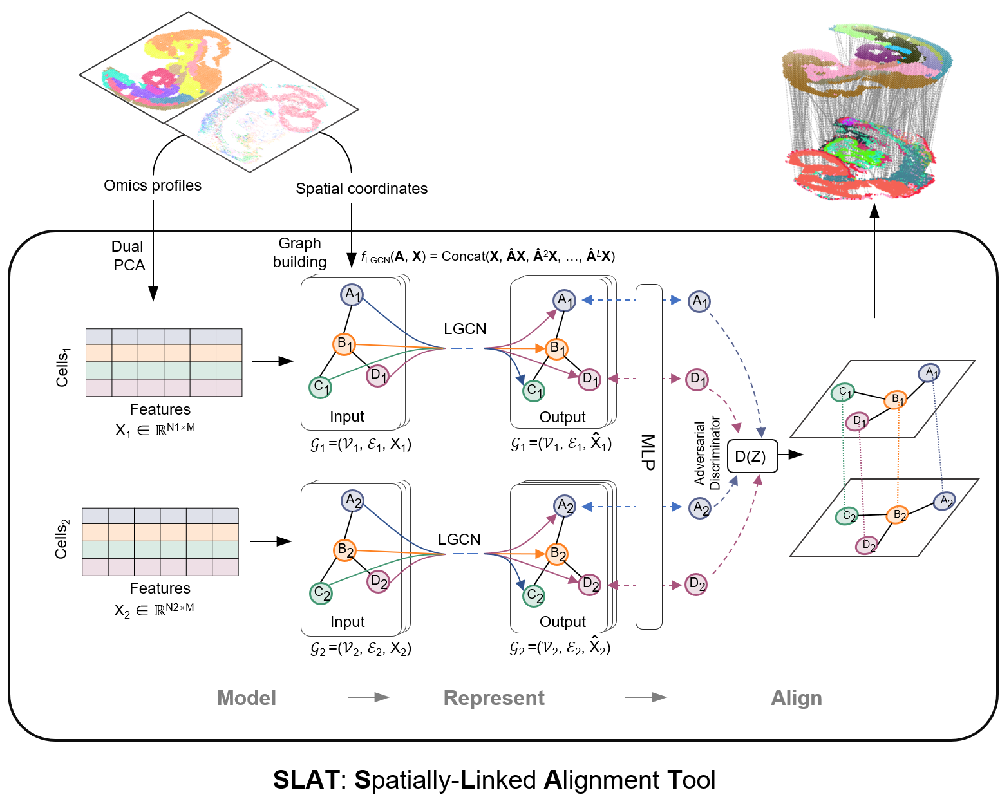

[](https://github.com/gao-lab/SLAT/stargazers)
[](https://gist.github.com/xiachenrui/bc835db052fde5bd731a09270b42006c)
[](https://github.com/gao-lab/SLAT/actions/workflows/build.yml)
[](https://opensource.org/licenses/MIT)
[](https://slat.readthedocs.io/en/latest/?badge=latest)

<!-- [](https://pypi.org/project/<name>) -->

<!-- [](https://anaconda.org/bioconda/<name>) -->

# scSLAT: single cell spatial alignment tools

**scSLAT** package implements the **SLAT** (**S**patial **L**inked **A**lignment **T**ool) model to align single cell spatial omics data.



## Directory structure

```
.
├── scSLAT/                  # Main Python package
├── env/                     # Extra environment
├── data/                    # Data files
├── evaluation/              # SLAT evaluation pipeline
├── benchmark/               # Benchmark pipeline
├── case/                    # Case studies in paper
├── docs/                    # Documentation files
├── resource/                # Other useful resource 
├── pyproject.toml           # Python package metadata
└── README.md
```

## Tutorial

Tutorial of `scSLAT` is [here](https://slat.readthedocs.io/en/latest/), if you have any question please open an issue on github


## Installation
### Docker

Dockerfile of `scSLAT` is available at [`env/Dockerfile`](env/Dockerfile). You can also pull the docker image directly from [here](https://hub.docker.com/repository/docker/huhansan666666/slat) by :
```
docker pull huhansan666666/slat:latest
```

### Development
> Installing `scSLAT` within a new [conda environment](https://conda.io/projects/conda/en/latest/user-guide/tasks/manage-environments.html) is recommended.
> Warning: machine with old NVIDIA driver may raise error, please update NVIDIA driver to the latest version or use Docker.

For development purpose, clone this repo and install:

```bash
git clone git@github.com:gao-lab/SLAT.git
cd SLAT
pip install -e ".[torch]"
pip install -e ".[pyg,dev,doc]"
```

### PyPI  (Ongoing)

Fist we create a clean environment and install `scSLAT` from PyPI:

> We need install dependency `torch` before install `pyg`.

```bash
conda create -n scSLAT python=3.8 -y && conda activate scSLAT
pip install scSLAT[torch]
pip install scSLAT[pyg]
```

### Conda (Ongoing)

We plan to provide a conda package of `scSLAT` in the near future.

## Reproduce manuscript results

1. Please follow the [`env/README.md`](env/README.md) to install all dependencies. Please checkout the repository to v0.1.0 before install `scSLAT`:

```
git clone git@github.com:gao-lab/SLAT.git
git checkout tags/v0.2.0
pip install -e ".[torch]"
pip install -e ".[pyg,dev,doc]"
```

2. Download and pre-process data follow the [`data/README.md`](data/README.md)
3. Whole benchmark and evaluation procedure can be found in `/benchmark` and `/evaluation`, respectively.
4. Every case study is recorded in the `/case` directory in the form of jupyter notebook.
