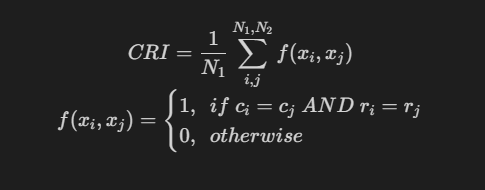

# Methods
We benchmark with following methods
| Method  | Graph based | For spatial | Cross platform |
| ------- | ----------- | ----------- | -------------- |
| SLAT    | yes         | yes         | yes            |
| STAGATE | yes         | yes         | no             |
| PASTE   | no          | yes         | no             |
| Seurat  | no          | no          | yes            |
| Harmony | no          | no          | yes            |


# Metric and datasets


Due to we can not know ground truth between real spatial datasets, so we newly design CRI (Celltype and Region matching Index) score to measure the performance of spatial alignment. First, we annotate every dataset by its histology region and cell type, according to source literature, then check how do alignment method recover corresponding celltype and histology region simultaneously.



We benchmark on following datasets:
> NOTE: Dataset download links are available at [`../data/README.md`](../data/README.md)
- 10x Visium--Brain(DLPFC)--3k cells
- Stereo_seq--Whole embryo(15.5 day)--4k cells
- MERFISH--Brain(hypothalamic preoptic)--100k cells


# Run
> NOTE: you may need install `snakemake` and other dependencies following [`env/README.md`](../env/README.md)

To repeat our benchmark, just run:
```shell
snakemake --profile profiles/local -p
```
